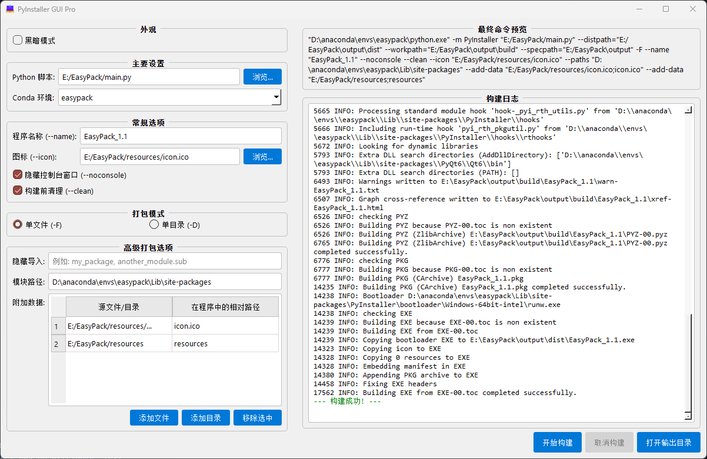

# EasyPack

**A beautiful and easy-to-use GUI packaging tool for PyInstaller, designed for Conda environments.**

## Introduction

```
pyinstaller -F --paths=E:\anaconda3\envs\yt_dlp_env\Lib\site-packages --python=E:\anaconda3\envs\yt_dlp_env\python.exe  --noconsole  --icon=wx2.ico --name=Downloader test.py
```

This is a commonly used PyInstaller packaging command, but manually typing this long command every time is quite cumbersome.

This project initially started as a simple packaging program implemented with Tkinter. Now, it has evolved into a feature-rich, aesthetically pleasing PyQt6 application designed to solve the complexity and tedious configuration when using the `pyinstaller` command line directly.

This tool is particularly designed for Python developers who use **Conda** for environment management. It can automatically detect and list your Conda virtual environments, greatly simplifying the path configuration process. With just a few clicks, you can package your Python scripts without needing to remember complex commands.

## Application Screenshot



## Key Features

*   **Beautiful Graphical User Interface**: Built with PyQt6, offering a clean split-pane layout with clear configuration and log areas.
*   **Theme Switching**: Built-in light and dark themes that can be switched with one click based on preference.
*   **Deep Conda Integration**:
    *   Automatically scans and lists all local Conda virtual environments.
    *   Automatically populates the Python interpreter path and `site-packages` path for the selected environment.
*   **Smart Dependency Check**: Before starting the build, automatically checks if `pyinstaller` is installed in the selected environment. If not, it prompts the user to install it with one click.
*   **Comprehensive Packaging Options**:
    *   **Basic Options**: Supports switching between one-file (`-F`) and one-directory (`-D`) modes, custom program name (`--name`), adding icons (`--icon`), hiding the console (`--noconsole`), and other common functions.
    *   **Advanced Options**: Supports adding additional data files/directories (`--add-data`), adding hidden imports (`--hidden-import`), etc., via the graphical interface.
*   **Real-time Log Output**: Executes the packaging command in a separate thread. The build process logs are displayed in real-time in the log window on the right, preventing the interface from freezing.
*   **Unified Output Management**: All files generated by PyInstaller (`build` directory, `dist` directory, `.spec` files) are organized into an `output` folder located in the same directory as the source script, keeping the project root directory tidy.
*   **Convenient Operations**: After a successful build, the "Open Output Directory" button becomes active, allowing one-click access to the location of the generated executable file.

## Requirements

Before running this program, please ensure your system meets the following conditions:

1.  **Python**: Version 3.8 or higher.
2.  **PyQt6**: `pip install PyQt6`
3.  **Conda**: Anaconda or Miniconda must be installed, and the `conda` command must be added to the system's environment variable (PATH), allowing it to be called directly from the command line.

## How to Use

You can directly download the pre-packaged .exe file, or clone this repository.

#### Packaging Steps

1.  **Select Script**: Click the "Browse..." button next to "Python Script" to select the main Python file you want to package. The program name is usually automatically filled based on the filename.
2.  **Select Environment**: In the "Conda Environment" dropdown menu, select the virtual environment used by your project. After selection, the relevant module paths will be automatically populated.
3.  **Customize Options**:
    *   Modify the program name or add an icon as needed.
    *   Choose the packaging mode (One File or One Directory).
    *   Add extra data files or libraries that need to be forcibly included in the "Advanced Packaging Options" section.
4.  **Preview Command**: Check the command about to be executed in the "Final Command Preview" window on the right to ensure it meets your expectations.
5.  **Start Build**: Click the "Start Build" button in the lower right corner.
6.  **View Logs**: Observe the real-time output in the "Build Log" window.
7.  **Completion**:
    *   If the build is successful, the log will display a success message in **green** font, and the "Open Directory" button will become active.
    *   If the build fails, the log will display a failure message in **red** font, allowing you to troubleshoot the issue based on the log.

## Project Structure

This project adopts a layered design, separating the interface, logic, and main program for easier maintenance and extension.

* `main.py`

  > **Main Program Entry**. Responsible for creating the PyQt6 application instance, initializing the main window, and connecting signals from the interface (`ui_components.py`) to the slot functions of the backend logic (`builder.py`).

* `ui_components.py`

  > **Interface Layer (View)**. Contains the `PyInstallerGUI` class, which uses PyQt6 to handle the creation, layout, styling, and theme switching of all UI controls. It only handles interface display and user interaction and does not contain any time-consuming business logic.

* `builder.py`

  > **Logic Layer (Controller/Worker)**. Contains the `BuildWorker` class, which inherits from `QObject` and runs in a separate `QThread`. All time-consuming operations (such as executing PyInstaller commands) are completed here and communicate safely with the UI layer through PyQt's signal mechanism, thus preventing the interface from freezing.